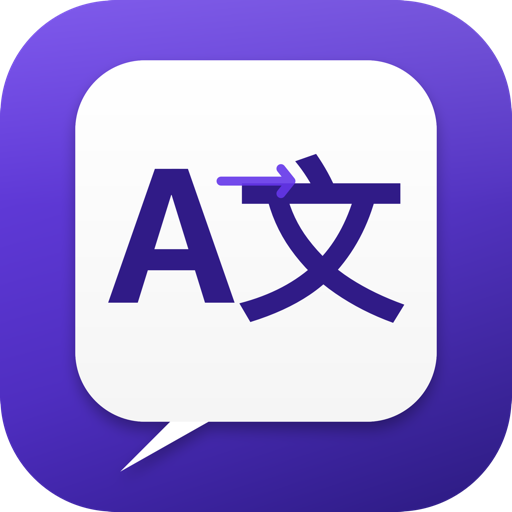
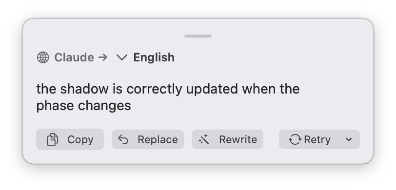
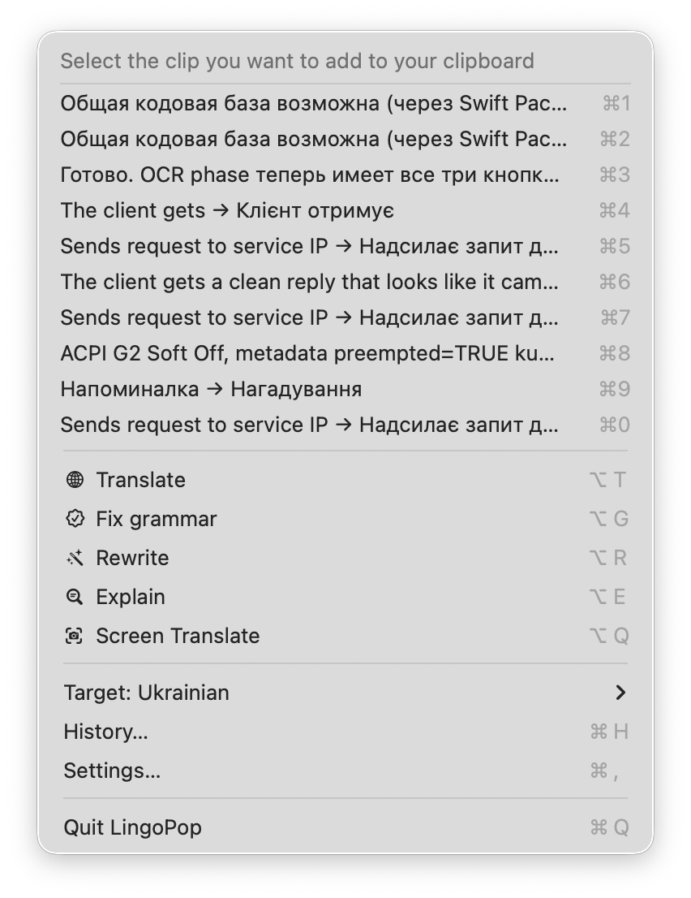
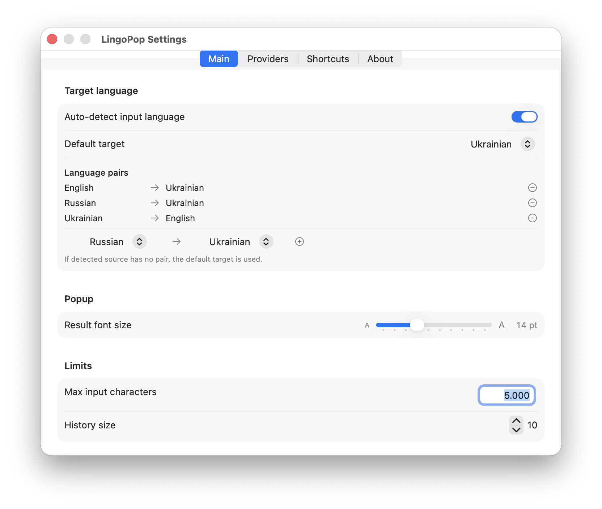
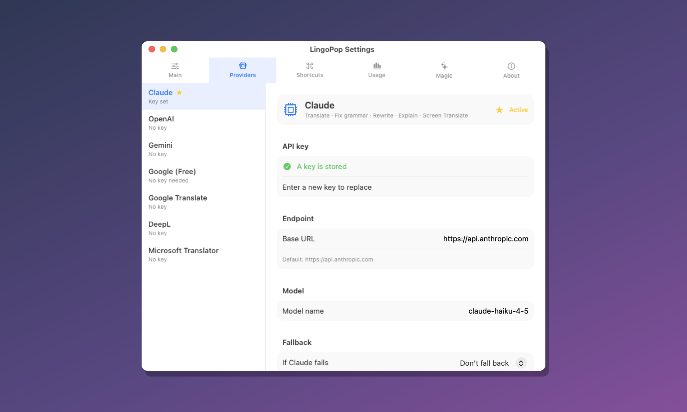
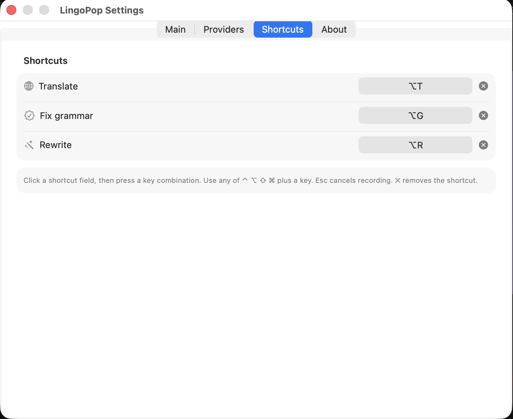
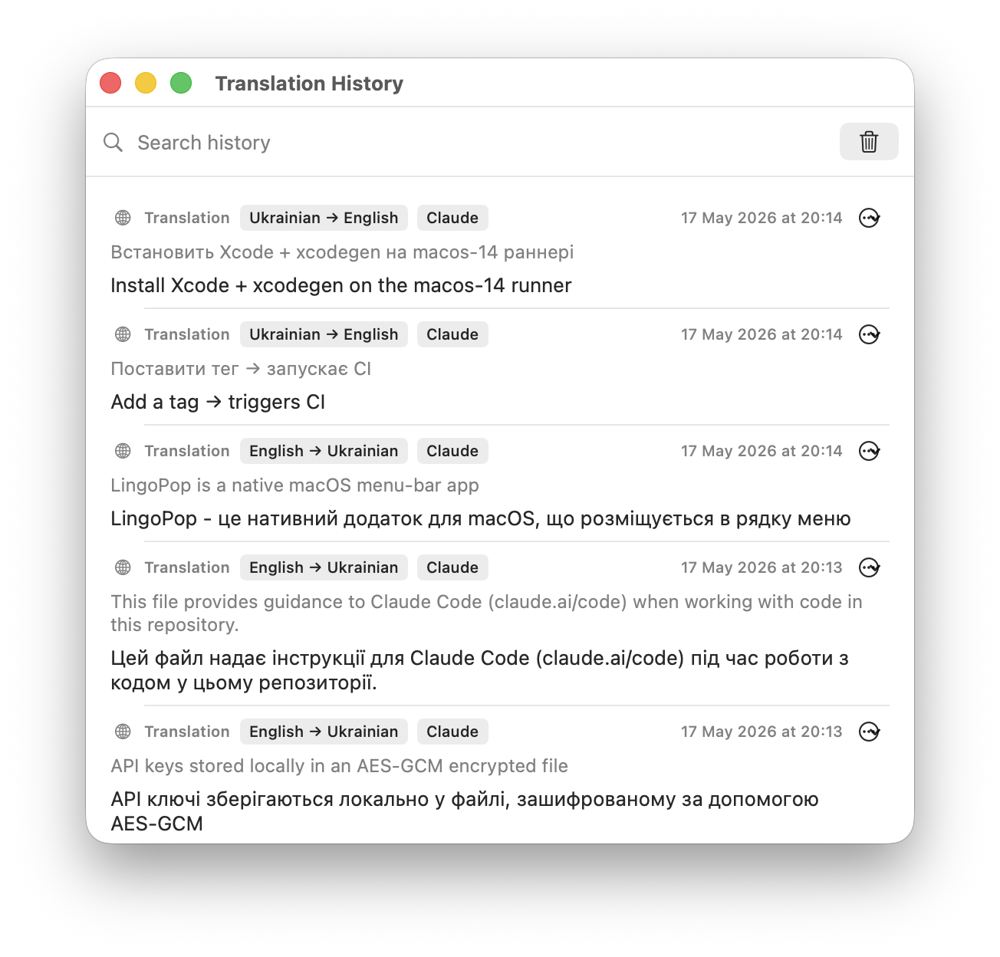

<p align="center">
  
</p>

<h1 align="center">LingoPop</h1>

<p align="center">
  Native macOS menu-bar app: select text anywhere, press a hotkey, get an AI translation, grammar fix, or rewrite in a popup near your cursor.
</p>

<p align="center">
  <a href="https://github.com/slucheninov/lingopop/releases/latest">
    
  </a>
  
  
</p>

## Screenshots

<p align="center">
  
</p>

<p align="center">
  
</p>

<p align="center">
  
  &nbsp;
  
</p>

<p align="center">
  
</p>

<p align="center">
  
</p>

## Features

- 🌐 **Translate** to any target language. Optional auto-detect picks the target from your language pairs (defaults: Russian ↔ Ukrainian, English → Ukrainian); otherwise uses the default target
- ✓ **Fix grammar** — spelling, punctuation, and grammar only; meaning and style stay the same
- ✨ **Rewrite** — clearer wording in the same language; meaning and tone preserved
- ⌨️ Three separate global hotkeys (one per operation). **Translate** ships with **⌥T**; Fix grammar and Rewrite are unset until you assign them
- 📋 Popup actions: **Copy**, **Replace** (pastes back into the source app), **Retry with another provider**
- 🤖 Seven providers: **Claude**, **OpenAI**, **Gemini** (all three operations), **Google (Free)**, **Google Translate**, **DeepL**, and **Microsoft Translator** (translate only)
- 🔁 Per-provider fallback — on 429, 5xx, or network errors, retries once with the fallback you pick for that provider
- 📜 Translation history (0–100 entries, default 10). The three most recent results appear at the top of the menu-bar dropdown for one-click copy
- ☁️ Settings and history sync via iCloud Drive when available (on by default). API keys stay on each Mac, encrypted with AES-GCM

## Install

1. Download the latest **`LingoPop-X.Y.Z-mac-universal.dmg`** from [Releases](https://github.com/slucheninov/lingopop/releases/latest).
2. Open the dmg and drag **LingoPop** into the **Applications** folder.
3. **First launch:** the app is ad-hoc signed (not notarized), so macOS Gatekeeper will warn. Right-click `LingoPop.app` in Applications → **Open** → click **Open** in the dialog. You'll only see this once.
4. Grant **Accessibility** access when prompted:
   - System Settings → Privacy & Security → Accessibility
   - Enable the toggle next to LingoPop
   - **Fully quit** LingoPop (menu-bar icon → Quit) and relaunch — macOS only reads the new permission on app start.

### Install via zip

```bash
cd ~/Downloads
unzip LingoPop-X.Y.Z-mac-universal.zip
mv LingoPop.app /Applications/
xattr -dr com.apple.quarantine /Applications/LingoPop.app   # bypass Gatekeeper without right-click
open /Applications/LingoPop.app
```

### Architecture-specific builds

| Asset | Size | Runs on |
|---|---|---|
| `LingoPop-X.Y.Z-mac-universal.dmg` / `.zip` | ~1.2 MB | Apple Silicon **and** Intel |
| `LingoPop-X.Y.Z-mac-arm64.zip` | ~800 KB | Apple Silicon only |
| `LingoPop-X.Y.Z-mac-x86_64.zip` | ~830 KB | Intel only |

When in doubt, take the universal build.

## Setup

After first launch, click the LingoPop icon in the menu bar → **Settings…** (or **⌘,**).

### Main

- **Target language** — choose a fixed target, or turn on **Auto-detect input language** and edit **language pairs** (source → target). Unmatched sources use the default target
- **Limits** — **Max input characters** (default 5000) and **History size** (0–100, default 10)
- **Startup** — **Launch at login**
- **iCloud Drive sync** — sync settings and history between Macs on the same Apple ID (enabled when iCloud Drive is available). API keys are never synced
- **Accessibility** — required to read selected text via simulated Copy. Grant access in System Settings, then fully quit and relaunch LingoPop

### Providers

Sidebar lists all seven providers. The starred one is **active** (used for hotkeys and menu actions).

Per provider:

- **Set as active** — switch which provider runs your next operation
- **API key** — required for all providers except **Google (Free)**
- **Endpoint** / **Model** — defaults work out of the box; override base URL or model if needed
- **HTTP Referer** — optional, only for **Google Translate** (for API keys restricted by HTTP referrer in Google Cloud Console)
- **Region** — optional, only for **Microsoft Translator** (required for multi-service or regional Azure resources; leave empty for global free-tier F0 resources)
- **Fallback** — pick another provider to try once on rate-limit, server, or network errors

Configure keys for several providers and switch the active one anytime. **Fix grammar** and **Rewrite** require Claude, OpenAI, or Gemini — the four translation-only providers are DeepL, Microsoft Translator, Google Translate, and Google (Free).

Click **Save** on the detail pane after editing a provider.

### Shortcuts

Assign a global shortcut per operation: **Translate**, **Fix grammar**, **Rewrite**. Click the field, press a combination with **⌃ ⌥ ⇧ ⌘** plus a key; **Esc** cancels, **✕** clears.

### About

App version and a short overview.

### Menu bar

Besides **Settings…** and **History…**:

- The top of the menu lists up to **three recent results** — click to copy
- **Translate** / **Fix grammar** / **Rewrite** run the operation on the current selection (shortcut shown in parentheses when set)
- **Target:** submenu — quick switch for the default target language

**Workflow:** select text in any app → press your hotkey (or pick an operation from the menu) → popup appears near the cursor.

## Getting API keys

| Provider in Settings | Operations | Key |
|---|---|---|
| Claude | Translate · Fix grammar · Rewrite | [console.anthropic.com](https://console.anthropic.com/) |
| OpenAI | Translate · Fix grammar · Rewrite | [platform.openai.com/api-keys](https://platform.openai.com/api-keys) |
| Gemini | Translate · Fix grammar · Rewrite | [aistudio.google.com/apikey](https://aistudio.google.com/apikey) |
| DeepL | Translate only | [www.deepl.com/pro-api](https://www.deepl.com/pro-api) — free tier (500k chars/mo) available. Free keys end in `:fx`; change the base URL to `https://api.deepl.com` for paid keys |
| Microsoft Translator | Translate only | [Azure Cognitive Services](https://portal.azure.com/) — free tier (F0) gives 2M chars/mo |
| Google Translate | Translate only | [console.cloud.google.com](https://console.cloud.google.com/apis/credentials) — enable Cloud Translation API |
| Google (Free) | Translate only | No key — unofficial public endpoint |

## Why does macOS warn me about an unidentified developer?

The maintainer doesn't pay for an Apple Developer Program subscription ($99/yr), so the app is **ad-hoc signed** instead of notarized. The signature still proves the binary hasn't been tampered with after build, but Gatekeeper can't verify the publisher. You only see the warning on first launch.

If you'd rather not bypass Gatekeeper at all, build LingoPop from source (request access to the private source repo from the maintainer).

## Requirements

- macOS 13 (Ventura) or later
- **Accessibility** permission (to capture selected text)
- An API key for the active provider, unless you use **Google (Free)** or only need translate via a configured Google provider

## Privacy

See [PRIVACY.md](PRIVACY.md). Short version:

- API keys live in `~/Library/Application Support/LingoPop/secrets.dat` — AES-GCM encrypted, key bound to your machine's hardware UUID.
- Settings and translation history sync via your iCloud Drive folder (you can disable this in Settings → Main).
- The app makes outbound HTTPS calls only to the AI provider you choose. No telemetry, no analytics.

## Changelog

See [CHANGELOG.md](CHANGELOG.md) or browse [Releases](https://github.com/slucheninov/lingopop/releases).

## Issues & feedback

Open an [issue](https://github.com/slucheninov/lingopop/issues/new/choose) with your macOS version, LingoPop version, and steps to reproduce.

## License

See [LICENSE](LICENSE).
